# ACGStream

##### 介绍

这是一个集视频/小说/漫画的网站。具有上传，用户管理，限流，权限控制，审核，数据收集的前、后端分离项目。

#### 软件架构

- **后端框架**：Spring Boot 2.x + Spring Security

- **持久层**：MyBatis-Plus（增强版MyBatis）

- **数据库**：MySQL

- **缓存**：Redis

- **认证授权**：JWT（JSON Web Tokens）

- **文件存储**：本地文件系统

#### 安全控制 & 限流机制&文件分层

采用基于角色的访问控制（RBAC）和JWT令牌认证

- `SecurityConfig.java` 配置了完整的安全策略
- 使用`@PreAuthorize("hasRole('ADMIN')")`等注解控制接口权限
- 支持多种认证方式（登录/注册/匿名访问）
- 跨域配置完善（CORS）

实现了基于Redis的**滑动窗口限流算法**：

- 使用Lua脚本保证原子性
- 支持多种限流维度（IP/用户/全局）
- 可配置不同接口的限流策略
- 异常情况下自动放行，保证系统可用性

采用**分层目录结构**和**唯一文件名生成**：

- 目录结构：`{basePath}/{type}/{yyyy/MM/dd}/{uuid}.{ext}`
- 使用UUID避免文件名冲突
- 自动创建目录结构
- 提供文件删除功能

#### 安装教程

部署

1. 修改配置文件application.yml，deploy.sh文件
2. 进入项目根目录， sh deploy.sh，等待脚本执行完成即可
   

#### 使用说明

随意点即可， 无任何的操作难度 

#### 展示页面内容

1、登录
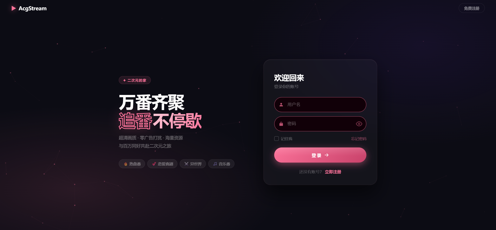

2、首页

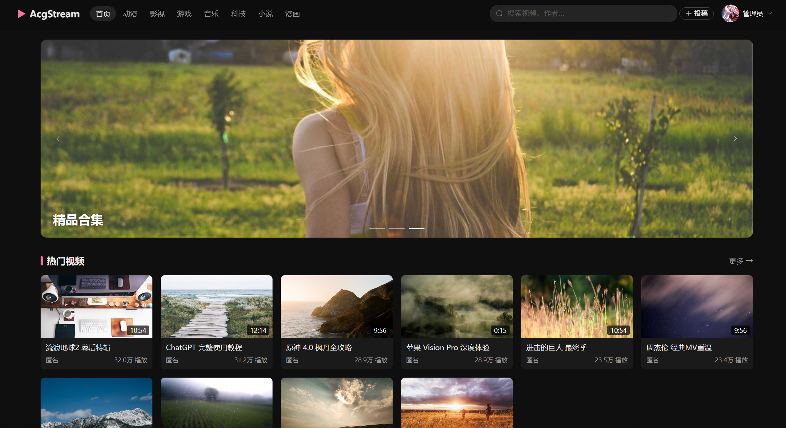

3、导航动漫分类

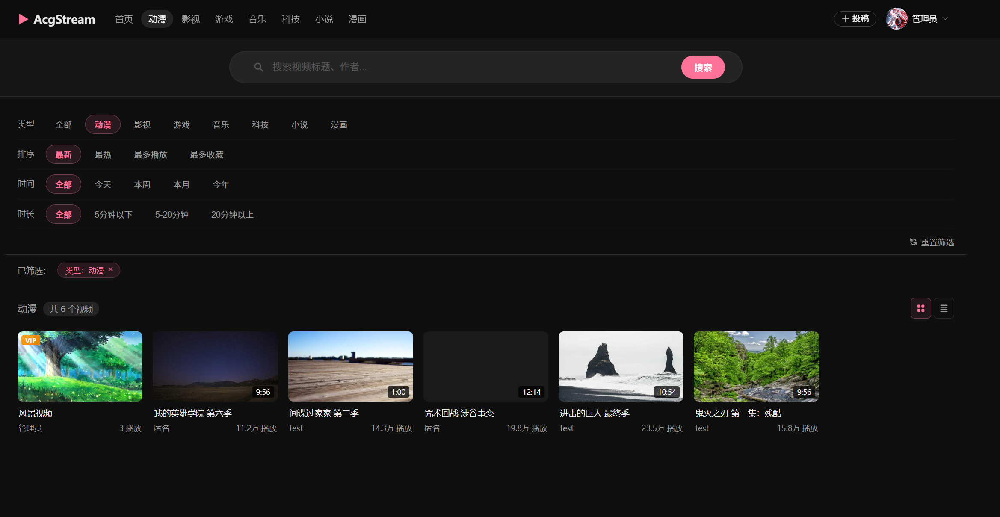

4、投稿

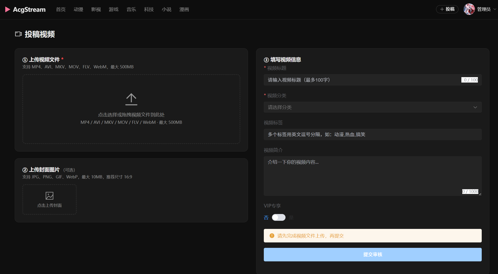

5、用户中心

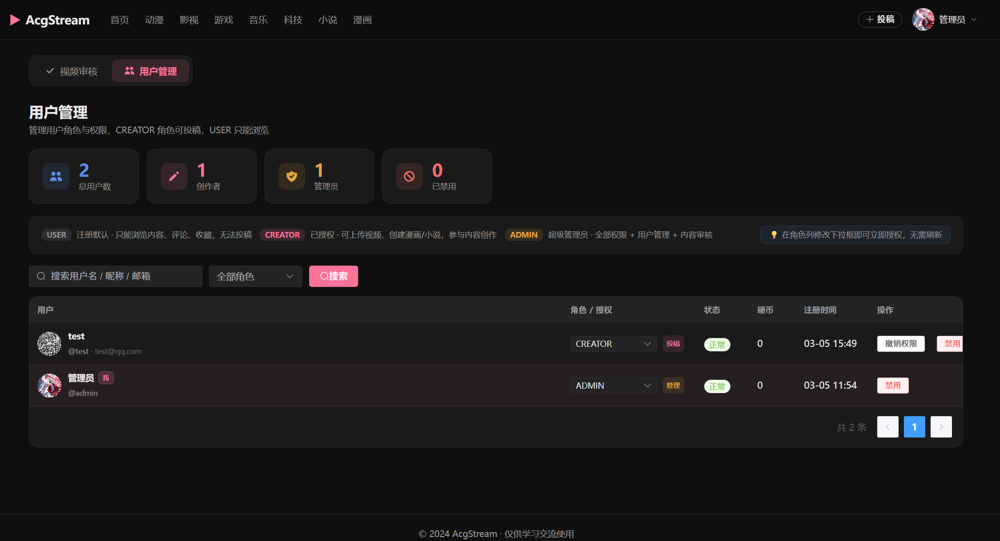

6、小说

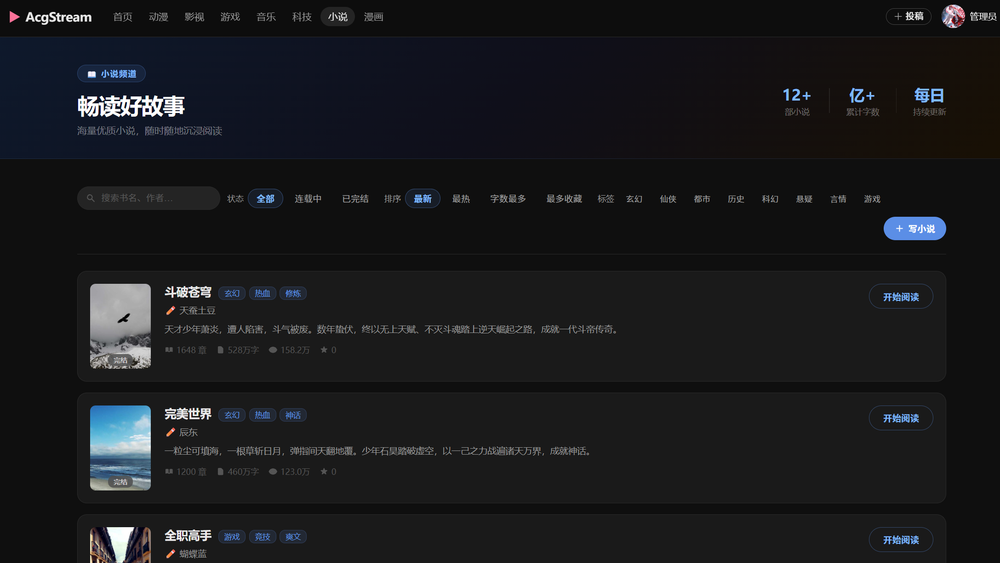

7、漫画

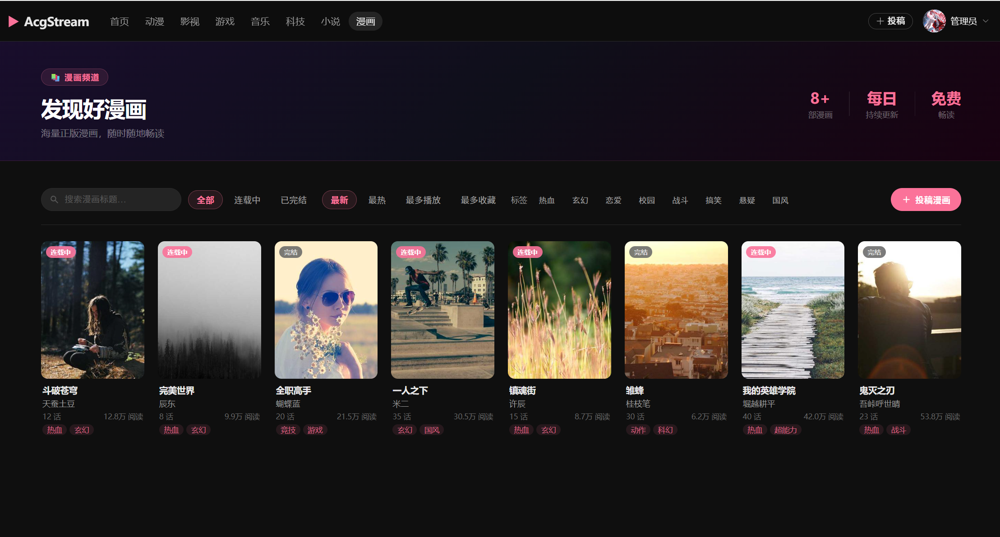

8、审核

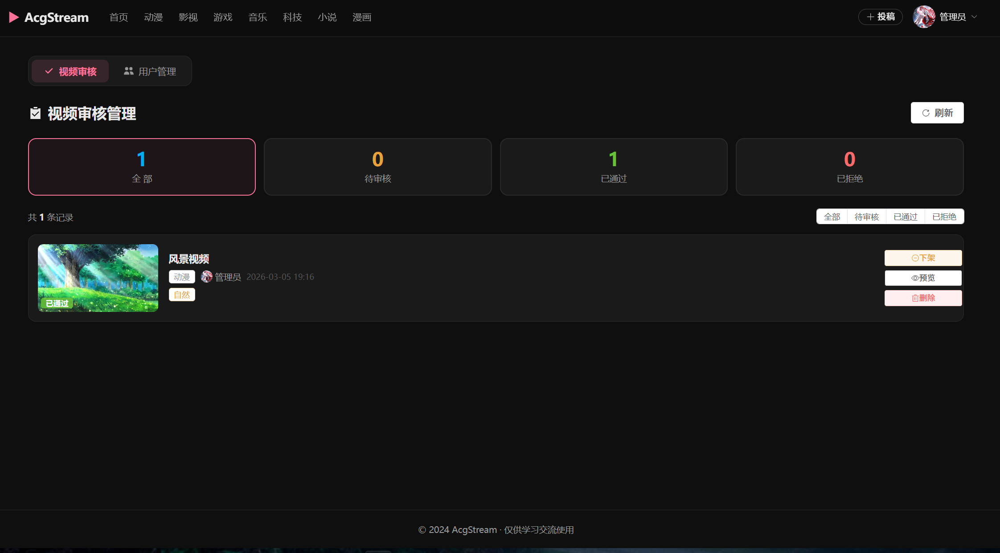

9、用户管理

10、数据看板

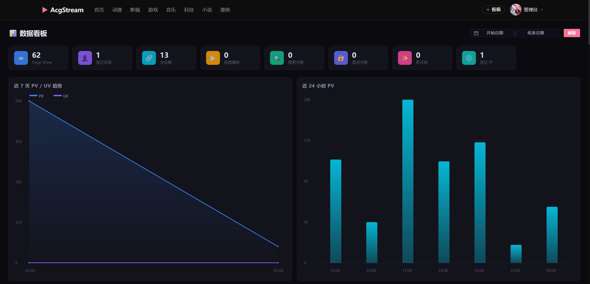

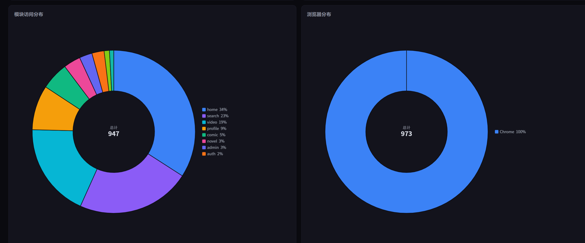

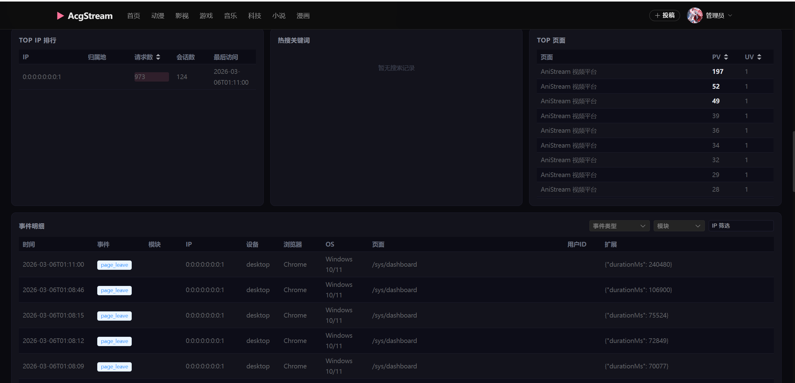
